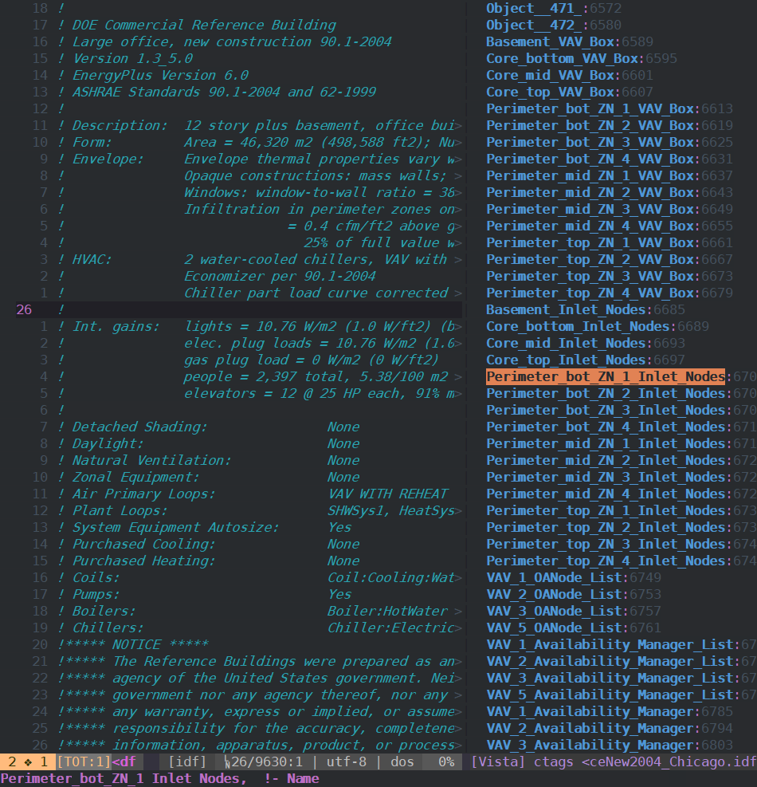

<!-- README.md is generated from README.Rmd. Please edit that file -->

# idftags

<!-- badges: start -->

<!-- badges: end -->

The goal of idftags is to create
[ctags](https://github.com/universal-ctags/ctags)-compatible tag file
for [EnergyPlus](https://energyplus.net) IDFs.

## Installation

You can install the released version of idftags from
[GitHub](https://github.com/hongyuanjia/idftags) with:

``` r
# install.packages("remotes")
remotes::install_github("hongyuanjia/idftags")
```

## Example

This is a basic example which shows you how to solve a common problem:

``` r
library(idftags)
file <- system.file("extdata/1ZoneUncontrolled.idf", package = "eplusr")
build_idf_tags(file)
#> !_TAG_FILE_FORMAT    2   /extended format; --format=1 will not append ;" to lines/
#> !_TAG_FILE_SORTED    0   /0=unsorted, 1=sorted, 2=foldcase/
#> !_TAG_PROGRAM_AUTHOR Hongyuan Jia    /email: hongyuanjia@outlook.com/
#> !_TAG_PROGRAM_NAME   idftags R package   //
#> !_TAG_PROGRAM_URL    https://github.com/hongyuanjia/idftags  //
#> !_TAG_PROGRAM_VERSION    0.0.1   /
#> !_TAG_OUTPUT_MODE    u-ctags /u-ctags or e-ctags/
#> !_TAG_OUTPUT_FILESEP slash   slash or backslash/
#> !_TAG_PROC_CWD   /c/Users/hongy/Dropbox/github_repo/idftag/  //
#> !_TAG_OUTPUT_EXCMD   mixed   /number, pattern, mixed, or combineV2/
#> !_TAG_KIND_DESCRIPTION!IDF   c,class /EnergyPlus IDD classes/
#> !_TAG_KIND_DESCRIPTION!IDF   o,object    /EnergyPlus IDF objects/
#> Version  /home/hongyuanjia/R/x86_64-pc-linux-gnu-library/4.1/eplusr/extdata/1ZoneUncontrolled.idf    /^Version,8.8;$/;"  c   line:91
#> Timestep /home/hongyuanjia/R/x86_64-pc-linux-gnu-library/4.1/eplusr/extdata/1ZoneUncontrolled.idf    /^Timestep,4;$/;"   c   line:93
#> Building /home/hongyuanjia/R/x86_64-pc-linux-gnu-library/4.1/eplusr/extdata/1ZoneUncontrolled.idf    /^Building,$/;" c   line:95
#> HeatBalanceAlgorithm /home/hongyuanjia/R/x86_64-pc-linux-gnu-library/4.1/eplusr/extdata/1ZoneUncontrolled.idf    /^HeatBalanceAlgorithm,ConductionTransferFunction;$/;"  c   line:105
#> SurfaceConvectionAlgorithm:Inside    /home/hongyuanjia/R/x86_64-pc-linux-gnu-library/4.1/eplusr/extdata/1ZoneUncontrolled.idf    /^SurfaceConvectionAlgorithm:Inside,TARP;$/;"   c   line:107
#> SurfaceConvectionAlgorithm:Outside   /home/hongyuanjia/R/x86_64-pc-linux-gnu-library/4.1/eplusr/extdata/1ZoneUncontrolled.idf    /^SurfaceConvectionAlgorithm:Outside,DOE-2;$/;" c   line:109
#> SimulationControl    /home/hongyuanjia/R/x86_64-pc-linux-gnu-library/4.1/eplusr/extdata/1ZoneUncontrolled.idf    /^SimulationControl,$/;"    c   line:111
#> RunPeriod    /home/hongyuanjia/R/x86_64-pc-linux-gnu-library/4.1/eplusr/extdata/1ZoneUncontrolled.idf    /^RunPeriod,$/;"    c   line:118
#> Site:Location    /home/hongyuanjia/R/x86_64-pc-linux-gnu-library/4.1/eplusr/extdata/1ZoneUncontrolled.idf    /^Site:Location,$/;"    c   line:131
#> SizingPeriod:DesignDay   /home/hongyuanjia/R/x86_64-pc-linux-gnu-library/4.1/eplusr/extdata/1ZoneUncontrolled.idf    /^SizingPeriod:DesignDay,$/;"   c   line:144
#> SizingPeriod:DesignDay   /home/hongyuanjia/R/x86_64-pc-linux-gnu-library/4.1/eplusr/extdata/1ZoneUncontrolled.idf    /^SizingPeriod:DesignDay,$/;"   c   line:176
#> Material:NoMass  /home/hongyuanjia/R/x86_64-pc-linux-gnu-library/4.1/eplusr/extdata/1ZoneUncontrolled.idf    /^Material:NoMass,$/;"  c   line:204
#> Material:NoMass  /home/hongyuanjia/R/x86_64-pc-linux-gnu-library/4.1/eplusr/extdata/1ZoneUncontrolled.idf    /^Material:NoMass,$/;"  c   line:212
#> Material /home/hongyuanjia/R/x86_64-pc-linux-gnu-library/4.1/eplusr/extdata/1ZoneUncontrolled.idf    /^Material,$/;" c   line:220
#> Construction /home/hongyuanjia/R/x86_64-pc-linux-gnu-library/4.1/eplusr/extdata/1ZoneUncontrolled.idf    /^Construction,$/;" c   line:231
#> Construction /home/hongyuanjia/R/x86_64-pc-linux-gnu-library/4.1/eplusr/extdata/1ZoneUncontrolled.idf    /^Construction,$/;" c   line:235
#> Construction /home/hongyuanjia/R/x86_64-pc-linux-gnu-library/4.1/eplusr/extdata/1ZoneUncontrolled.idf    /^Construction,$/;" c   line:239
#> Zone /home/hongyuanjia/R/x86_64-pc-linux-gnu-library/4.1/eplusr/extdata/1ZoneUncontrolled.idf    /^Zone,$/;" c   line:243
#> ScheduleTypeLimits   /home/hongyuanjia/R/x86_64-pc-linux-gnu-library/4.1/eplusr/extdata/1ZoneUncontrolled.idf    /^ScheduleTypeLimits,$/;"   c   line:254
#> GlobalGeometryRules  /home/hongyuanjia/R/x86_64-pc-linux-gnu-library/4.1/eplusr/extdata/1ZoneUncontrolled.idf    /^GlobalGeometryRules,$/;"  c   line:260
#> BuildingSurface:Detailed /home/hongyuanjia/R/x86_64-pc-linux-gnu-library/4.1/eplusr/extdata/1ZoneUncontrolled.idf    /^BuildingSurface:Detailed,$/;" c   line:265
#> BuildingSurface:Detailed /home/hongyuanjia/R/x86_64-pc-linux-gnu-library/4.1/eplusr/extdata/1ZoneUncontrolled.idf    /^BuildingSurface:Detailed,$/;" c   line:281
#> BuildingSurface:Detailed /home/hongyuanjia/R/x86_64-pc-linux-gnu-library/4.1/eplusr/extdata/1ZoneUncontrolled.idf    /^BuildingSurface:Detailed,$/;" c   line:297
#> BuildingSurface:Detailed /home/hongyuanjia/R/x86_64-pc-linux-gnu-library/4.1/eplusr/extdata/1ZoneUncontrolled.idf    /^BuildingSurface:Detailed,$/;" c   line:313
#> BuildingSurface:Detailed /home/hongyuanjia/R/x86_64-pc-linux-gnu-library/4.1/eplusr/extdata/1ZoneUncontrolled.idf    /^BuildingSurface:Detailed,$/;" c   line:329
#> BuildingSurface:Detailed /home/hongyuanjia/R/x86_64-pc-linux-gnu-library/4.1/eplusr/extdata/1ZoneUncontrolled.idf    /^BuildingSurface:Detailed,$/;" c   line:345
#> Output:Variable  /home/hongyuanjia/R/x86_64-pc-linux-gnu-library/4.1/eplusr/extdata/1ZoneUncontrolled.idf    /^Output:Variable,*,Site Outdoor Air Drybulb Temperature,hourly;$/;"    c   line:361
#> Output:Variable  /home/hongyuanjia/R/x86_64-pc-linux-gnu-library/4.1/eplusr/extdata/1ZoneUncontrolled.idf    /^Output:Variable,*,Site Daylight Saving Time Status,daily;$/;" c   line:363
#> Output:Variable  /home/hongyuanjia/R/x86_64-pc-linux-gnu-library/4.1/eplusr/extdata/1ZoneUncontrolled.idf    /^Output:Variable,*,Site Day Type Index,daily;$/;"  c   line:365
#> Output:Variable  /home/hongyuanjia/R/x86_64-pc-linux-gnu-library/4.1/eplusr/extdata/1ZoneUncontrolled.idf    /^Output:Variable,*,Zone Mean Air Temperature,hourly;$/;"   c   line:367
#> Output:Variable  /home/hongyuanjia/R/x86_64-pc-linux-gnu-library/4.1/eplusr/extdata/1ZoneUncontrolled.idf    /^Output:Variable,*,Zone Total Internal Latent Gain Energy,hourly;$/;"  c   line:369
#> Output:Variable  /home/hongyuanjia/R/x86_64-pc-linux-gnu-library/4.1/eplusr/extdata/1ZoneUncontrolled.idf    /^Output:Variable,*,Zone Mean Radiant Temperature,hourly;$/;"   c   line:371
#> Output:Variable  /home/hongyuanjia/R/x86_64-pc-linux-gnu-library/4.1/eplusr/extdata/1ZoneUncontrolled.idf    /^Output:Variable,*,Zone Air Heat Balance Surface Convection Rate,hourly;$/;"   c   line:373
#> Output:Variable  /home/hongyuanjia/R/x86_64-pc-linux-gnu-library/4.1/eplusr/extdata/1ZoneUncontrolled.idf    /^Output:Variable,*,Zone Air Heat Balance Air Energy Storage Rate,hourly;$/;"   c   line:375
#> Output:Variable  /home/hongyuanjia/R/x86_64-pc-linux-gnu-library/4.1/eplusr/extdata/1ZoneUncontrolled.idf    /^Output:Variable,*,Surface Inside Face Temperature,daily;$/;"  c   line:377
#> Output:Variable  /home/hongyuanjia/R/x86_64-pc-linux-gnu-library/4.1/eplusr/extdata/1ZoneUncontrolled.idf    /^Output:Variable,*,Surface Outside Face Temperature,daily;$/;" c   line:379
#> Output:Variable  /home/hongyuanjia/R/x86_64-pc-linux-gnu-library/4.1/eplusr/extdata/1ZoneUncontrolled.idf    /^Output:Variable,*,Surface Inside Face Convection Heat Transfer Coefficient,daily;$/;" c   line:381
#> Output:Variable  /home/hongyuanjia/R/x86_64-pc-linux-gnu-library/4.1/eplusr/extdata/1ZoneUncontrolled.idf    /^Output:Variable,*,Surface Outside Face Convection Heat Transfer Coefficient,daily;$/;"    c   line:383
#> Output:Variable  /home/hongyuanjia/R/x86_64-pc-linux-gnu-library/4.1/eplusr/extdata/1ZoneUncontrolled.idf    /^Output:Variable,*,Other Equipment Total Heating Energy,monthly;$/;"   c   line:385
#> Output:Variable  /home/hongyuanjia/R/x86_64-pc-linux-gnu-library/4.1/eplusr/extdata/1ZoneUncontrolled.idf    /^Output:Variable,*,Zone Other Equipment Total Heating Energy,monthly;$/;"  c   line:387
#> Output:VariableDictionary    /home/hongyuanjia/R/x86_64-pc-linux-gnu-library/4.1/eplusr/extdata/1ZoneUncontrolled.idf    /^Output:VariableDictionary,IDF;$/;"    c   line:389
#> Output:Surfaces:Drawing  /home/hongyuanjia/R/x86_64-pc-linux-gnu-library/4.1/eplusr/extdata/1ZoneUncontrolled.idf    /^Output:Surfaces:Drawing,dxf:wireframe;$/;"    c   line:391
#> Output:Constructions /home/hongyuanjia/R/x86_64-pc-linux-gnu-library/4.1/eplusr/extdata/1ZoneUncontrolled.idf    /^Output:Constructions,Constructions;$/;"   c   line:393
#> Output:Meter:MeterFileOnly   /home/hongyuanjia/R/x86_64-pc-linux-gnu-library/4.1/eplusr/extdata/1ZoneUncontrolled.idf    /^Output:Meter:MeterFileOnly,ExteriorLights:Electricity,hourly;$/;" c   line:395
#> Output:Meter:MeterFileOnly   /home/hongyuanjia/R/x86_64-pc-linux-gnu-library/4.1/eplusr/extdata/1ZoneUncontrolled.idf    /^Output:Meter:MeterFileOnly,EnergyTransfer:Building,hourly;$/;"    c   line:397
#> Output:Meter:MeterFileOnly   /home/hongyuanjia/R/x86_64-pc-linux-gnu-library/4.1/eplusr/extdata/1ZoneUncontrolled.idf    /^Output:Meter:MeterFileOnly,EnergyTransfer:Facility,hourly;$/;"    c   line:399
#> OutputControl:Table:Style    /home/hongyuanjia/R/x86_64-pc-linux-gnu-library/4.1/eplusr/extdata/1ZoneUncontrolled.idf    /^OutputControl:Table:Style,$/;"    c   line:401
#> Output:Table:SummaryReports  /home/hongyuanjia/R/x86_64-pc-linux-gnu-library/4.1/eplusr/extdata/1ZoneUncontrolled.idf    /^Output:Table:SummaryReports,$/;"  c   line:404
#> Exterior:Lights  /home/hongyuanjia/R/x86_64-pc-linux-gnu-library/4.1/eplusr/extdata/1ZoneUncontrolled.idf    /^Exterior:Lights,$/;"  c   line:407
#> ScheduleTypeLimits   /home/hongyuanjia/R/x86_64-pc-linux-gnu-library/4.1/eplusr/extdata/1ZoneUncontrolled.idf    /^ScheduleTypeLimits,$/;"   c   line:414
#> OtherEquipment   /home/hongyuanjia/R/x86_64-pc-linux-gnu-library/4.1/eplusr/extdata/1ZoneUncontrolled.idf    /^OtherEquipment,$/;"   c   line:420
#> OtherEquipment   /home/hongyuanjia/R/x86_64-pc-linux-gnu-library/4.1/eplusr/extdata/1ZoneUncontrolled.idf    /^OtherEquipment,$/;"   c   line:433
#> Schedule:Constant    /home/hongyuanjia/R/x86_64-pc-linux-gnu-library/4.1/eplusr/extdata/1ZoneUncontrolled.idf    /^Schedule:Constant,AlwaysOn,On/Off,1.0;$/;"    c   line:446
#> Object [1]   /home/hongyuanjia/R/x86_64-pc-linux-gnu-library/4.1/eplusr/extdata/1ZoneUncontrolled.idf    /^Version,8.8;$/;"  o   line:91 class:Version
#> Object [2]   /home/hongyuanjia/R/x86_64-pc-linux-gnu-library/4.1/eplusr/extdata/1ZoneUncontrolled.idf    /^Timestep,4;$/;"   o   line:93 class:Timestep
#> Simple One Zone (Wireframe DXF)  /home/hongyuanjia/R/x86_64-pc-linux-gnu-library/4.1/eplusr/extdata/1ZoneUncontrolled.idf    /^Simple One Zone (Wireframe DXF),  !- Name$/;" o   line:96 class:Building
#> Object [4]   /home/hongyuanjia/R/x86_64-pc-linux-gnu-library/4.1/eplusr/extdata/1ZoneUncontrolled.idf    /^HeatBalanceAlgorithm,ConductionTransferFunction;$/;"  o   line:105    class:HeatBalanceAlgorithm
#> Object [5]   /home/hongyuanjia/R/x86_64-pc-linux-gnu-library/4.1/eplusr/extdata/1ZoneUncontrolled.idf    /^SurfaceConvectionAlgorithm:Inside,TARP;$/;"   o   line:107    class:SurfaceConvectionAlgorithm:Inside
#> Object [6]   /home/hongyuanjia/R/x86_64-pc-linux-gnu-library/4.1/eplusr/extdata/1ZoneUncontrolled.idf    /^SurfaceConvectionAlgorithm:Outside,DOE-2;$/;" o   line:109    class:SurfaceConvectionAlgorithm:Outside
#> Object [7]   /home/hongyuanjia/R/x86_64-pc-linux-gnu-library/4.1/eplusr/extdata/1ZoneUncontrolled.idf    /^SimulationControl,$/;"    o   line:111    class:SimulationControl
#> Object [8]   /home/hongyuanjia/R/x86_64-pc-linux-gnu-library/4.1/eplusr/extdata/1ZoneUncontrolled.idf    /^,                        !- Name$/;"  o   line:119    class:RunPeriod
#> Denver Centennial  Golden   N_CO_USA Design_Conditions   /home/hongyuanjia/R/x86_64-pc-linux-gnu-library/4.1/eplusr/extdata/1ZoneUncontrolled.idf    /^Denver Centennial  Golden   N_CO_USA Design_Conditions,  !- Name$/;"  o   line:132    class:Site:Location
#> Denver Centennial  Golden   N Ann Htg 99% Condns DB  /home/hongyuanjia/R/x86_64-pc-linux-gnu-library/4.1/eplusr/extdata/1ZoneUncontrolled.idf    /^Denver Centennial  Golden   N Ann Htg 99% Condns DB,  !- Name$/;" o   line:145    class:SizingPeriod:DesignDay
#> Denver Centennial  Golden   N Ann Clg 1% Condns DB=>MWB  /home/hongyuanjia/R/x86_64-pc-linux-gnu-library/4.1/eplusr/extdata/1ZoneUncontrolled.idf    /^Denver Centennial  Golden   N Ann Clg 1% Condns DB=>MWB,  !- Name$/;" o   line:177    class:SizingPeriod:DesignDay
#> R13LAYER /home/hongyuanjia/R/x86_64-pc-linux-gnu-library/4.1/eplusr/extdata/1ZoneUncontrolled.idf    /^R13LAYER,                !- Name$/;"  o   line:205    class:Material:NoMass
#> R31LAYER /home/hongyuanjia/R/x86_64-pc-linux-gnu-library/4.1/eplusr/extdata/1ZoneUncontrolled.idf    /^R31LAYER,                !- Name$/;"  o   line:213    class:Material:NoMass
#> C5 - 4 IN HW CONCRETE    /home/hongyuanjia/R/x86_64-pc-linux-gnu-library/4.1/eplusr/extdata/1ZoneUncontrolled.idf    /^C5 - 4 IN HW CONCRETE,   !- Name$/;"  o   line:221    class:Material
#> R13WALL  /home/hongyuanjia/R/x86_64-pc-linux-gnu-library/4.1/eplusr/extdata/1ZoneUncontrolled.idf    /^R13WALL,                 !- Name$/;"  o   line:232    class:Construction
#> FLOOR    /home/hongyuanjia/R/x86_64-pc-linux-gnu-library/4.1/eplusr/extdata/1ZoneUncontrolled.idf    /^FLOOR,                   !- Name$/;"  o   line:236    class:Construction
#> ROOF31   /home/hongyuanjia/R/x86_64-pc-linux-gnu-library/4.1/eplusr/extdata/1ZoneUncontrolled.idf    /^ROOF31,                  !- Name$/;"  o   line:240    class:Construction
#> ZONE ONE /home/hongyuanjia/R/x86_64-pc-linux-gnu-library/4.1/eplusr/extdata/1ZoneUncontrolled.idf    /^ZONE ONE,                !- Name$/;"  o   line:244    class:Zone
#> Fraction /home/hongyuanjia/R/x86_64-pc-linux-gnu-library/4.1/eplusr/extdata/1ZoneUncontrolled.idf    /^Fraction,                !- Name$/;"  o   line:255    class:ScheduleTypeLimits
#> Object [20]  /home/hongyuanjia/R/x86_64-pc-linux-gnu-library/4.1/eplusr/extdata/1ZoneUncontrolled.idf    /^GlobalGeometryRules,$/;"  o   line:260    class:GlobalGeometryRules
#> Zn001:Wall001    /home/hongyuanjia/R/x86_64-pc-linux-gnu-library/4.1/eplusr/extdata/1ZoneUncontrolled.idf    /^Zn001:Wall001,           !- Name$/;"  o   line:266    class:BuildingSurface:Detailed
#> Zn001:Wall002    /home/hongyuanjia/R/x86_64-pc-linux-gnu-library/4.1/eplusr/extdata/1ZoneUncontrolled.idf    /^Zn001:Wall002,           !- Name$/;"  o   line:282    class:BuildingSurface:Detailed
#> Zn001:Wall003    /home/hongyuanjia/R/x86_64-pc-linux-gnu-library/4.1/eplusr/extdata/1ZoneUncontrolled.idf    /^Zn001:Wall003,           !- Name$/;"  o   line:298    class:BuildingSurface:Detailed
#> Zn001:Wall004    /home/hongyuanjia/R/x86_64-pc-linux-gnu-library/4.1/eplusr/extdata/1ZoneUncontrolled.idf    /^Zn001:Wall004,           !- Name$/;"  o   line:314    class:BuildingSurface:Detailed
#> Zn001:Flr001 /home/hongyuanjia/R/x86_64-pc-linux-gnu-library/4.1/eplusr/extdata/1ZoneUncontrolled.idf    /^Zn001:Flr001,            !- Name$/;"  o   line:330    class:BuildingSurface:Detailed
#> Zn001:Roof001    /home/hongyuanjia/R/x86_64-pc-linux-gnu-library/4.1/eplusr/extdata/1ZoneUncontrolled.idf    /^Zn001:Roof001,           !- Name$/;"  o   line:346    class:BuildingSurface:Detailed
#> Object [27]  /home/hongyuanjia/R/x86_64-pc-linux-gnu-library/4.1/eplusr/extdata/1ZoneUncontrolled.idf    /^Output:Variable,*,Site Outdoor Air Drybulb Temperature,hourly;$/;"    o   line:361    class:Output:Variable
#> Object [28]  /home/hongyuanjia/R/x86_64-pc-linux-gnu-library/4.1/eplusr/extdata/1ZoneUncontrolled.idf    /^Output:Variable,*,Site Daylight Saving Time Status,daily;$/;" o   line:363    class:Output:Variable
#> Object [29]  /home/hongyuanjia/R/x86_64-pc-linux-gnu-library/4.1/eplusr/extdata/1ZoneUncontrolled.idf    /^Output:Variable,*,Site Day Type Index,daily;$/;"  o   line:365    class:Output:Variable
#> Object [30]  /home/hongyuanjia/R/x86_64-pc-linux-gnu-library/4.1/eplusr/extdata/1ZoneUncontrolled.idf    /^Output:Variable,*,Zone Mean Air Temperature,hourly;$/;"   o   line:367    class:Output:Variable
#> Object [31]  /home/hongyuanjia/R/x86_64-pc-linux-gnu-library/4.1/eplusr/extdata/1ZoneUncontrolled.idf    /^Output:Variable,*,Zone Total Internal Latent Gain Energy,hourly;$/;"  o   line:369    class:Output:Variable
#> Object [32]  /home/hongyuanjia/R/x86_64-pc-linux-gnu-library/4.1/eplusr/extdata/1ZoneUncontrolled.idf    /^Output:Variable,*,Zone Mean Radiant Temperature,hourly;$/;"   o   line:371    class:Output:Variable
#> Object [33]  /home/hongyuanjia/R/x86_64-pc-linux-gnu-library/4.1/eplusr/extdata/1ZoneUncontrolled.idf    /^Output:Variable,*,Zone Air Heat Balance Surface Convection Rate,hourly;$/;"   o   line:373    class:Output:Variable
#> Object [34]  /home/hongyuanjia/R/x86_64-pc-linux-gnu-library/4.1/eplusr/extdata/1ZoneUncontrolled.idf    /^Output:Variable,*,Zone Air Heat Balance Air Energy Storage Rate,hourly;$/;"   o   line:375    class:Output:Variable
#> Object [35]  /home/hongyuanjia/R/x86_64-pc-linux-gnu-library/4.1/eplusr/extdata/1ZoneUncontrolled.idf    /^Output:Variable,*,Surface Inside Face Temperature,daily;$/;"  o   line:377    class:Output:Variable
#> Object [36]  /home/hongyuanjia/R/x86_64-pc-linux-gnu-library/4.1/eplusr/extdata/1ZoneUncontrolled.idf    /^Output:Variable,*,Surface Outside Face Temperature,daily;$/;" o   line:379    class:Output:Variable
#> Object [37]  /home/hongyuanjia/R/x86_64-pc-linux-gnu-library/4.1/eplusr/extdata/1ZoneUncontrolled.idf    /^Output:Variable,*,Surface Inside Face Convection Heat Transfer Coefficient,daily;$/;" o   line:381    class:Output:Variable
#> Object [38]  /home/hongyuanjia/R/x86_64-pc-linux-gnu-library/4.1/eplusr/extdata/1ZoneUncontrolled.idf    /^Output:Variable,*,Surface Outside Face Convection Heat Transfer Coefficient,daily;$/;"    o   line:383    class:Output:Variable
#> Object [39]  /home/hongyuanjia/R/x86_64-pc-linux-gnu-library/4.1/eplusr/extdata/1ZoneUncontrolled.idf    /^Output:Variable,*,Other Equipment Total Heating Energy,monthly;$/;"   o   line:385    class:Output:Variable
#> Object [40]  /home/hongyuanjia/R/x86_64-pc-linux-gnu-library/4.1/eplusr/extdata/1ZoneUncontrolled.idf    /^Output:Variable,*,Zone Other Equipment Total Heating Energy,monthly;$/;"  o   line:387    class:Output:Variable
#> Object [41]  /home/hongyuanjia/R/x86_64-pc-linux-gnu-library/4.1/eplusr/extdata/1ZoneUncontrolled.idf    /^Output:VariableDictionary,IDF;$/;"    o   line:389    class:Output:VariableDictionary
#> Object [42]  /home/hongyuanjia/R/x86_64-pc-linux-gnu-library/4.1/eplusr/extdata/1ZoneUncontrolled.idf    /^Output:Surfaces:Drawing,dxf:wireframe;$/;"    o   line:391    class:Output:Surfaces:Drawing
#> Object [43]  /home/hongyuanjia/R/x86_64-pc-linux-gnu-library/4.1/eplusr/extdata/1ZoneUncontrolled.idf    /^Output:Constructions,Constructions;$/;"   o   line:393    class:Output:Constructions
#> Object [44]  /home/hongyuanjia/R/x86_64-pc-linux-gnu-library/4.1/eplusr/extdata/1ZoneUncontrolled.idf    /^Output:Meter:MeterFileOnly,ExteriorLights:Electricity,hourly;$/;" o   line:395    class:Output:Meter:MeterFileOnly
#> Object [45]  /home/hongyuanjia/R/x86_64-pc-linux-gnu-library/4.1/eplusr/extdata/1ZoneUncontrolled.idf    /^Output:Meter:MeterFileOnly,EnergyTransfer:Building,hourly;$/;"    o   line:397    class:Output:Meter:MeterFileOnly
#> Object [46]  /home/hongyuanjia/R/x86_64-pc-linux-gnu-library/4.1/eplusr/extdata/1ZoneUncontrolled.idf    /^Output:Meter:MeterFileOnly,EnergyTransfer:Facility,hourly;$/;"    o   line:399    class:Output:Meter:MeterFileOnly
#> Object [47]  /home/hongyuanjia/R/x86_64-pc-linux-gnu-library/4.1/eplusr/extdata/1ZoneUncontrolled.idf    /^OutputControl:Table:Style,$/;"    o   line:401    class:OutputControl:Table:Style
#> Object [48]  /home/hongyuanjia/R/x86_64-pc-linux-gnu-library/4.1/eplusr/extdata/1ZoneUncontrolled.idf    /^Output:Table:SummaryReports,$/;"  o   line:404    class:Output:Table:SummaryReports
#> ExtLights    /home/hongyuanjia/R/x86_64-pc-linux-gnu-library/4.1/eplusr/extdata/1ZoneUncontrolled.idf    /^ExtLights,               !- Name$/;"  o   line:408    class:Exterior:Lights
#> On/Off   /home/hongyuanjia/R/x86_64-pc-linux-gnu-library/4.1/eplusr/extdata/1ZoneUncontrolled.idf    /^On/Off,                  !- Name$/;"  o   line:415    class:ScheduleTypeLimits
#> Test 352a    /home/hongyuanjia/R/x86_64-pc-linux-gnu-library/4.1/eplusr/extdata/1ZoneUncontrolled.idf    /^Test 352a,               !- Name$/;"  o   line:421    class:OtherEquipment
#> Test 352 minus   /home/hongyuanjia/R/x86_64-pc-linux-gnu-library/4.1/eplusr/extdata/1ZoneUncontrolled.idf    /^Test 352 minus,          !- Name$/;"  o   line:434    class:OtherEquipment
#> AlwaysOn,On/Off,1.0; /home/hongyuanjia/R/x86_64-pc-linux-gnu-library/4.1/eplusr/extdata/1ZoneUncontrolled.idf    /^Schedule:Constant,AlwaysOn,On/Off,1.0;$/;"    o   line:446    class:Schedule:Constant
```

## Use together with Vim

  - Install
    [vista.vim](https://raw.githubusercontent.com/liuchengxu/vista.vim)
    using [vim-plug](https://github.com/junegunn/vim-plug)

<!-- end list -->

``` vim
Plug 'liuchengxu/vista.vim'
```

  - Add below to your vimrc

<!-- end list -->

``` vim
let g:vista_ctags_cmd = {
    \ 'idf': 'Rscript -e "idftags::build_idf_tag(cmd = TRUE)"'
    \ }
```

``` r

```


